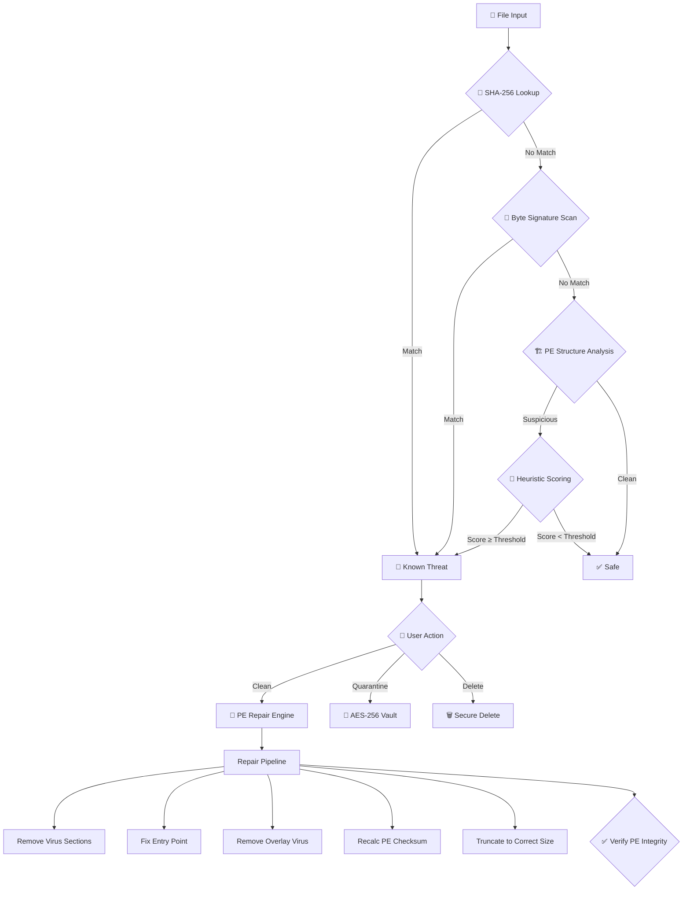

<p align="center">
  
</p>

<h1 align="center">🛡️ VeraxCore Antivirus</h1>

<p align="center">
  <strong>Real Protection. Zero Noise.</strong><br/>
  <em>Free, Open-Source, Intelligent Antivirus & PE Repair Engine for Windows</em>
</p>

<p align="center">
  <a href="#-supported-windows-versions"></a>
  <a href="#-supported-windows-versions"></a>
  <a href="https://github.com/alisakkaf/VeraxCore-Antivirus/releases"></a>
  <a href="LICENSE"></a>
</p>

<p align="center">
  <a href="#"></a>
  <a href="#"></a>
  <a href="#"></a>
  <a href="#"></a>
</p>

<p align="center">
  <a href="https://github.com/alisakkaf/VeraxCore-Antivirus/releases"></a>
<a href="https://github.com/alisakkaf/VeraxCore-Antivirus/stargazers">
  
</a>
  <a href="https://github.com/alisakkaf/VeraxCore-Antivirus/issues"></a>
  <a href="README.ar.md"></a>
</p>

<p align="center">
  <a href="#-screenshots">Screenshots</a> •
  <a href="#-features">Features</a> •
  <a href="#-supported-windows-versions">Compatibility</a> •
  <a href="#-architecture">Architecture</a> •
  <a href="#-installation">Installation</a> •
  <a href="#-building-from-source">Build</a> •
  <a href="#-faq">FAQ</a> •
  <a href="#-troubleshooting">Troubleshooting</a>
</p>

---

## 📖 About

**VeraxCore Antivirus** is a free, open-source antivirus solution for Windows built with C++17 and Qt 5.15+. It combines multiple detection engines — **SHA-256 signature matching**, **byte-pattern scanning**, **PE structural analysis**, and **heuristic scoring** — to detect and **repair** infected executables and DLLs without destroying them.

Unlike most antivirus tools that simply delete infected files, VeraxCore features an advanced **PE repair engine** that can surgically remove virus code from infected files while preserving the original program's functionality — similar to how enterprise-grade antivirus engines work.

> 💡 **Did you know?** Most free antivirus solutions simply delete your infected programs. VeraxCore is one of the few open-source tools that can actually **repair** them — removing only the virus while keeping the original program intact and fully functional.

### 🎯 Why VeraxCore?

| Problem | VeraxCore Solution |
|---|---|
| Antivirus deletes your infected files | **Repairs** them — removes virus, keeps the program working |
| Programs crash after cleaning (0xc0000142) | **Smart EP restoration** — detects if virus modified the entry point |
| File sizes change after repair | **Precise PE surgery** — preserves overlay data & digital certificates |
| False positives on legitimate programs | **Multi-engine verification** — 4 detection methods must agree |
| Complex antivirus with heavy resource usage | **Lightweight** — under 50MB, no background services eating RAM |
| Antivirus needs internet connection | **Fully offline** — all engines work without internet |
| Expensive commercial antivirus licenses | **100% Free & Open Source** — GPLv3, forever free |
| Antivirus breaks DLL dependencies | **DLL-aware repair** — different prologue restoration for DLLs |
| Can't recover quarantined files | **AES-256 encrypted vault** — restore anytime with full integrity |
| No visibility into scan results | **Detailed JSON reports** — full audit trail for every scan |

---

## 🖥️ Supported Windows Versions

VeraxCore is designed to work across a wide range of Windows versions and architectures:

| Windows Version | Architecture | Status | Notes |
|---|---|---|---|
| **Windows 11** (23H2, 24H2) | x64, ARM64 | ✅ Fully Supported | Primary development target |
| **Windows 11** (21H2, 22H2) | x64, ARM64 | ✅ Fully Supported | |
| **Windows 10** (22H2) | x86, x64 | ✅ Fully Supported | Most tested version |
| **Windows 10** (21H2, 21H1) | x86, x64 | ✅ Fully Supported | |
| **Windows 10** (1809–20H2) | x86, x64 | ✅ Supported | |
| **Windows 8.1** | x86, x64 | ⚠️ Compatible | Not actively tested |
| **Windows 8** | x86, x64 | ⚠️ Compatible | Limited testing |
| **Windows 7** SP1 | x86, x64 | ⚠️ Compatible | Requires KB updates |
| **Windows Server 2019/2022** | x64 | ✅ Supported | Server environments |
| **Windows Server 2016** | x64 | ⚠️ Compatible | |

### Architecture Support

| Architecture | Support Level | Details |
|---|---|---|
| **x64 (AMD64)** | ✅ Full | Primary target, all features |
| **x86 (32-bit)** | ✅ Full | Complete functionality |
| **ARM64** | ⚠️ Via Emulation | Works through Windows x86/x64 emulation layer |

### System Requirements

| Component | Minimum | Recommended |
|---|---|---|
| **OS** | Windows 7 SP1 | Windows 10/11 |
| **Processor** | 1 GHz single core | 2 GHz dual core |
| **RAM** | 256 MB | 512 MB+ |
| **Disk Space** | 50 MB (app) | 200 MB (app + UserData) |
| **Privileges** | Administrator | Administrator |
| **Display** | 1024×768 | 1280×720+ |
| **.NET** | Not required | — |
| **Internet** | Not required | Optional (for updates) |

---

## 📸 Screenshots

### 🛡️ Verax Shield (Branding)

<p align="center">
  <a href="https://ibb.co/mV8TCNQc">
    <kbd>
      
    </kbd>
  </a>
</p>

---

### 🖥️ Application Interface

<table align="center">
  <tr>
    <td align="center">
      <strong>2. Main Dashboard</strong><br/>
      <a href="https://ibb.co/DHRDFkdk">
        <kbd></kbd>
      </a>
    </td>
    <td align="center">
      <strong>3. Scanning Progress</strong><br/>
      <a href="https://ibb.co/7dLTkwQZ">
        <kbd></kbd>
      </a>
    </td>
  </tr>
  <tr>
    <td align="center">
      <strong>4. Scan Options & Language</strong><br/>
      <a href="https://ibb.co/b5d0G05b">
        <kbd></kbd>
      </a>
    </td>
    <td align="center">
      <strong>5. Quarantine Vault</strong><br/>
      <a href="https://ibb.co/HTnZhpyv">
        <kbd></kbd>
      </a>
    </td>
  </tr>
  <tr>
    <td align="center">
      <strong>6. Settings Interface</strong><br/>
      <a href="https://ibb.co/dsrY0Ncx">
        <kbd></kbd>
      </a>
    </td>
    <td align="center">
      <strong>7. Installation Setup</strong><br/>
      <a href="https://ibb.co/HD142zXF">
        <kbd></kbd>
      </a>
    </td>
  </tr>
</table>

---

## ✨ Features

### 🔍 Multi-Engine Detection System

VeraxCore uses **four independent detection engines** that work together for maximum accuracy and minimal false positives:

#### Engine 1: SHA-256 Signature Database
- 65+ built-in malware signatures with metadata
- Online signature updates from secure JSON endpoint
- SQLite storage with JSON fallback for maximum compatibility
- Each signature includes: name, family, severity, repair method, byte patterns
- Automatic seed sync on startup

#### Engine 2: Byte-Pattern Scanner
- Wildcard-capable byte signatures (e.g., `E9??????????558BEC6AFF`)
- Multi-pattern per signature support
- Scans first 64KB of each file (configurable)
- Pattern matching with mask support (`?` = any byte)
- Section-aware scanning in PE headers

#### Engine 3: PE Structural Analysis
- Detects suspicious PE anomalies:
  - Sections with Read+Write+Execute (RWX) flags
  - Entry point outside .text section
  - Non-standard section names
  - Abnormal SizeOfRawData vs VirtualSize ratios
  - Double PE headers (dropper detection)
  - Suspicious import tables
- PE32 and PE32+ (64-bit) support

#### Engine 4: Heuristic Scoring
- Behavioral analysis with weighted scoring (0–100)
- Configurable threshold (default: 60)
- Factors analyzed:
  - Import API patterns (suspicious combinations)
  - Section characteristics
  - Entry point anomalies
  - Resource section analysis
  - String analysis

### 🔧 Advanced PE Repair Engine (Clean Threat)

The crown jewel of VeraxCore — a professional-grade PE file repair engine that rivals commercial antivirus solutions:

#### Section-Based Repair
- **Pass 1 — Named Section Removal**: Removes 25+ known virus sections:
  ```
  .flx, .floxif, .sality, .sal, .virut, .vrt, .rmnet, .ramnit,
  .parite, .expiro, .polip, .mabezat, .tenga, .lamer, .jeefo,
  .hidrag, .mydoom, .bagle, .neshta, .viking, .alman, .induc,
  .vetor, .mikcer, .mkc
  ```
- **Pass 2 — RWX Section Cleanup**: Detects and removes unnamed suspicious sections with Read+Write+Execute flags that aren't in the standard section whitelist
- **Pass 3 — Inflated Section Trimming**: Detects sections where the virus increased `SizeOfRawData` beyond `VirtualSize` (Floxif technique) and trims the excess

#### 35+ Protected Standard Sections
The engine knows and protects all legitimate PE sections from any compiler:
```
MSVC:     .text .code .rdata .data .bss .idata .edata .rsrc .reloc
          .tls .crt .gfids .00cfg .pdata .xdata .debug .didat
          .sxdata .voltbl .mrdata .textbss .shared .orpc .ndata
GCC:      .ctors .dtors .jcr .eh_fram .gcc_exc .got .got.plt .plt
Delphi:   code data bss .tls$
Go:       .symtab .typelink .itablink .gosymtab .gopclntab
Rust:     .rdata$r .rdata$t
Patterns: .rdata$* .text$* .data$* .CRT$* .debug$*
```

#### Overlay Virus Removal
- Calculates `lastSectionEnd` from PE headers
- Reads PE **Security Directory** (index 4) for Authenticode certificates
- If certificate exists: preserves it, removes virus body after it
- If no certificate: truncates to last section end
- Handles Floxif.H technique where virus body is appended as overlay

#### Smart Entry Point Repair
Three intelligent cases:

| Case | Condition | Action |
|---|---|---|
| **Case 1** | EP was in removed virus section | Scan .text for CRT startup pattern → set new EP |
| **Case 2** | EP bytes redirected (JMP/CALL) | Restore correct prologue bytes |
| **Case 3** | EP is untouched | **Do nothing** — don't break what works |

Prologue detection:
- **EXE (32-bit)**: `55 8B EC 6A FF` (push ebp; mov ebp,esp; push -1)
- **DLL (32-bit)**: `8B FF 55 8B EC` (mov edi,edi; push ebp; mov ebp,esp)
- **64-bit**: `48 83 EC 28 48` (sub rsp,40; mov...)
- **CRT Scan for EXE**: Pattern `558BEC6AFF68`
- **CRT Scan for DLL**: Pattern `8BFF558BEC837D0C`

#### PE Integrity Preservation
- SizeOfImage recalculation based on section alignment
- PE checksum recalculation
- Automatic backup (`.bak`) before any modification
- Auto-restore from backup if repair fails
- File permissions preservation

### 🛡️ Comprehensive Virus Family Support

| Family | Type | Technique | Detection | Repair | Files |
|---|---|---|---|---|---|
| **Floxif** (.A–.H) | Infector | EP hook + overlay append | ✅ | ✅ | EXE, DLL |
| **Floxif.EC!MTB** | Infector | EP hook + .flx section | ✅ | ✅ | EXE, DLL |
| **Sality** | Infector | Section append + EP redirect | ✅ | ✅ | EXE |
| **Ramnit** (.A–.G) | Infector | Section append + EP hook | ✅ | ✅ | EXE, DLL, HTML |
| **Virut** (.A–.E) | Infector | Code cave + EP hook | ✅ | ✅ | EXE, SCR |
| **Neshta** | Infector | Section append + file infector | ✅ | ✅ | EXE |
| **Mikcer** | Infector | EP hook + section append | ✅ | ✅ | EXE, DLL |
| **Parite** (.A–.B) | Infector | Polymorphic section append | ✅ | ✅ | EXE, DLL, SCR |
| **Expiro** | Infector | Code injection + section | ✅ | ✅ | EXE, DLL |
| **Mabezat** | Worm | Section append | ✅ | ✅ | EXE |
| **Viking** | Worm | Section append | ✅ | ✅ | EXE |
| **Alman** | Infector | Section append | ✅ | ✅ | EXE |
| **Polip** | Infector | EPO + section | ✅ | ✅ | EXE |
| **Tenga** | Infector | Section append | ✅ | ✅ | EXE |
| **Jeefo** | Infector | Section append | ✅ | ✅ | EXE |
| **Hidrag** | Trojan | Section append | ✅ | ✅ | EXE |
| **Mydoom** | Worm | PE manipulation | ✅ | ✅ | EXE |
| **Bagle** | Worm | PE manipulation | ✅ | ✅ | EXE |
| **Induc** | Infector | Delphi compilation | ✅ | ✅ | EXE, DLL |
| **Vetor** | Infector | Complex EPO | ✅ | ✅ | EXE |
| **Lamer** | Infector | Simple append | ✅ | ✅ | EXE |
| **Generic CodeCave** | Various | Code cave injection | ✅ | ✅ | EXE, DLL |
| **TrojanDownloader** | Trojan | Various PE manipulation | ✅ | ✅ | EXE |
| **Generic.CodeCave!A** | Various | Code cave | ✅ | ✅ | EXE, DLL |

### 🏦 Quarantine Vault
- **AES-256-CBC Encryption** — Files encrypted using Windows BCrypt API (FIPS 140-2 compliant)
- **HWID-Derived Key** — Encryption key derived from machine's unique MachineGuid via SHA-256
- **Secure Delete** — 3-pass overwrite (zeros → 0xFF → random) before deletion
- **Full Management** — Restore original file, permanently delete, or view quarantine details
- **Database Tracked** — Every quarantined item logged in SQLite with metadata
- **Size Tracking** — Total vault size visible in UI

### 📊 Scan Types
- **Quick Scan** — System-critical locations:
  - `%TEMP%` — Temporary files (common malware staging area)
  - `%USERPROFILE%\Downloads` — Downloaded files
  - `%APPDATA%` — Application data
  - `%LOCALAPPDATA%` — Local app data
  - `%ProgramData%` — Shared program data
  - Windows Startup folders (user + system)
  - Desktop
- **Full Scan** — Complete drive scan with recursive directory traversal
- **Custom Scan** — User-selected files or folders via file dialog
- **Folder Scan** — Single directory with optional subdirectory recursion
- **USB Auto-Scan** — Automatic scan triggered on USB device insertion

### 🌐 Additional Features

#### User Interface
- **Modern Glassmorphism Design** — Premium look with transparency effects
- **Dark & Light Themes** — Comfortable for any environment
- **Real-Time Progress** — Live file count, speed, and threat counter during scans
- **Threat Detail View** — Family name, severity, file path, detection method
- **Clean/Quarantine/Delete** — Per-threat action buttons
- **Scan History** — View past scans with results summary

#### Internationalization
- **English** — Full UI translation
- **Arabic (العربية)** — Full RTL UI translation
- **Extensible** — Add new languages via Qt `.ts` files

#### Online Updates
- **Signature Updates** — Auto-download from secure JSON endpoint
- **Version Check** — Automatic new version detection
- **Download Link** — Direct link to latest release
- **Progress Tracking** — Real-time download progress in UI

#### System Integration
- **Start with Windows** — Optional startup registration via registry
- **System Tray** — Minimize to notification area with context menu
- **Notifications** — Desktop notifications for scan completion and threats
- **UAC Integration** — Runs with Administrator privileges via embedded manifest
- **File Associations** — Right-click → "Scan with VeraxCore" (optional)

#### Data & Logging
- **Portable Data** — All data in `UserData/` next to executable (no AppData mess)
- **Rotating Logs** — 5MB per log file, keeps last 5 rotations
- **JSON Reports** — Detailed per-scan reports with timestamps
- **SQLite Database** — Signature storage with JSON automatic fallback
- **Audit Trail** — Complete scan history with threat details

#### Security Hardening
- **ASLR** — Address Space Layout Randomization enabled
- **DEP** — Data Execution Prevention enabled
- **CFG** — Control Flow Guard enabled
- **Secure Coding** — Buffer overflow protections throughout
- **Admin Required** — UAC manifest requires elevation

---

## 🏗️ Architecture

### Project Structure

```
VeraxShield/
├── 📄 main.cpp                    # Application entry point with splash screen
├── 📄 Version.h                   # Single source of truth for version/identity
├── 📄 harden.h                    # Security hardening macros (ASLR, DEP, CFG)
├── 📄 manifest.xml                # Windows UAC manifest (requireAdministrator)
├── 📄 app.rc                      # Windows resource file (icon, version info)
├── 📄 Verax.pro                   # Qt project file (qmake)
├── 📄 Verax.qrc                   # Qt resource collection
├── 📄 build.bat                   # Automated build script
│
├── 📁 src/
│   ├── 📁 core/                   # Core engine (no UI dependencies)
│   │   ├── Scanner.cpp/.h         # 🔍 Main scanning engine (4000+ lines)
│   │   │                          #    • SHA-256 hashing
│   │   │                          #    • Byte signature matching
│   │   │                          #    • PE structure analysis
│   │   │                          #    • Heuristic scoring
│   │   │                          #    • advancedCleanThreat() PE repair
│   │   │                          #    • repairEntryPoint()
│   │   │                          #    • detectOriginalPrologue()
│   │   │                          #    • recalcPeChecksum()
│   │   │                          #    • truncateOverlay()
│   │   │                          #    • backupBeforeRepair()
│   │   │
│   │   ├── SignatureDb.cpp/.h     # 📦 Dual-mode signature database
│   │   │                          #    • SQLite primary storage
│   │   │                          #    • JSON automatic fallback
│   │   │                          #    • Online update support
│   │   │                          #    • Byte signature loading
│   │   │                          #    • Family-based lookup
│   │   │
│   │   ├── Quarantine.cpp/.h      # 🏦 AES-256 encrypted vault
│   │   │                          #    • BCrypt API encryption
│   │   │                          #    • HWID-derived key
│   │   │                          #    • 3-pass secure delete
│   │   │                          #    • SQLite tracking
│   │   │
│   │   ├── Settings.cpp/.h        # ⚙️ Persistent settings
│   │   │                          #    • QSettings (registry-backed)
│   │   │                          #    • Startup registration
│   │   │                          #    • Engine toggles
│   │   │                          #    • Reset all functionality
│   │   │
│   │   └── Logger.cpp/.h          # 📝 Rotating file logger
│   │                              #    • userDataDir() — central path
│   │                              #    • 5MB rotation, keep 5
│   │                              #    • Thread-safe (QMutex)
│   │                              #    • Qt message handler bridge
│   │
│   ├── 📁 ui/
│   │   └── MainWindow.cpp/.h      # 🖥️ Main application window
│   │                              #    • Scan orchestration
│   │                              #    • Threat list management
│   │                              #    • Report generation
│   │                              #    • Settings dialog
│   │
│   ├── 📁 widgets/                # Custom UI widgets
│   │   ├── ScanOptionsDialog.*    # Scan configuration dialog
│   │   ├── AboutDialog.*          # About/credits dialog
│   │   └── ...                    # Additional dialogs
│   │
│   └── 📁 utils/                  # Utility functions
│
├── 📁 resources/
│   ├── 📁 signatures/
│   │   └── seed.json              # 📋 65+ built-in malware signatures
│   ├── 📁 sql/
│   │   └── schema.sql             # Database schema (signatures, quarantine, history)
│   ├── 📁 icons/                  # Application icons (multi-resolution)
│   └── 📁 themes/                 # UI themes (QSS stylesheets)
│
├── 📁 i18n/                       # 🌐 Translation files
│   ├── verax_en.ts                # English translations
│   └── verax_ar.ts                # Arabic translations
│
├── 📁 third_party/                # Third-party dependencies
├── 📁 docs/                       # Documentation
│   └── 📁 screenshots/            # UI screenshots for README
└── 📁 build/                      # Build output
```

### Core Engine Flow



### PE Repair Pipeline (Detailed)

```
┌─────────────────────────────────────────────────────────────────┐
│                    advancedCleanThreat()                         │
├─────────────────────────────────────────────────────────────────┤
│                                                                 │
│  📋 SETUP                                                       │
│  ├─ Create .bak backup                                          │
│  ├─ Memory-map file (read/write)                                │
│  ├─ Parse DOS → PE → Optional → Section headers                │
│  ├─ Detect PE32 vs PE32+ (64-bit)                               │
│  ├─ Extract fileAlign, secAlign, numSections                    │
│  └─ Determine isDll from FILE_HEADER.Characteristics            │
│                                                                 │
│  🔍 STEP A0: Analyze Entry Point                                │
│  ├─ Read first bytes at EP file offset                          │
│  ├─ Check for JMP (E9/E8/EB) redirect                          │
│  └─ Set epHasRedirect = true/false                              │
│                                                                 │
│  🔍 STEP A1: Recover Prologue from Virus Section                │
│  ├─ If JMP found → follow JMP target                            │
│  ├─ Search virus section for saved prologue                     │
│  └─ If found → write back to EP location                        │
│                                                                 │
│  🗑️ PASS 1: Remove Named Infector Sections                      │
│  ├─ Match section names against 25+ virus names                 │
│  ├─ memmove() to collapse section data                          │
│  ├─ Update section table in PE header                           │
│  ├─ Decrement NumberOfSections                                  │
│  └─ Track curSize -= sectionSize                                │
│                                                                 │
│  🗑️ PASS 2: Remove Orphaned RWX Sections                        │
│  ├─ Find sections with RWX flags                                │
│  ├─ Skip if name is in standard section whitelist (35+)         │
│  ├─ Same memmove + header update                                │
│  └─ Track curSize -= sectionSize                                │
│                                                                 │
│  ✂️ PASS 3: Trim Inflated Sections                               │
│  ├─ For each section:                                           │
│  │   correctRaw = ceil(VirtualSize / FileAlign) * FileAlign     │
│  ├─ If SizeOfRawData > correctRaw + 0x1000:                     │
│  │   ├─ Zero excess bytes                                       │
│  │   ├─ Update SizeOfRawData = correctRaw                       │
│  │   └─ curSize -= excess                                       │
│                                                                 │
│  🎯 STEP C: Fix Entry Point (3 Cases)                            │
│  ├─ Case 1: EP in removed section → CRT startup scan            │
│  ├─ Case 2: EP bytes redirected → restore prologue              │
│  └─ Case 3: EP untouched → DO NOTHING                           │
│                                                                 │
│  🧹 STEP D: Zero Code Caves                                     │
│  ├─ Scan for PUSHAD+delta patterns (60 E8 00 00 00 00)          │
│  ├─ Scan for PUSHFD+PUSHAD+CALL (9C 60 E8 00 00 00 00)         │
│  ├─ Zero each found pattern (256 bytes)                         │
│  └─ Remove WRITE flag from .text/.code                          │
│                                                                 │
│  📏 STEP E: Fix Headers + Remove Overlay Virus                   │
│  ├─ Recalculate SizeOfImage from last section                   │
│  ├─ Calculate lastSectionEnd                                    │
│  ├─ Read Security Directory for Authenticode cert               │
│  ├─ certEnd = secDir.VA + secDir.Size                           │
│  ├─ If file > certEnd → virus overlay detected                  │
│  ├─ correctSize = certEnd (or lastSectionEnd if no cert)        │
│  └─ Recalculate PE checksum                                     │
│                                                                 │
│  ✂️ STEP F: Truncate File                                        │
│  ├─ finalSize = min(curSize, correctSize)                       │
│  └─ QFile::resize(finalSize)                                    │
│                                                                 │
│  ✅ STEP G: Verify PE Integrity                                  │
│  ├─ Re-map and check DOS signature                              │
│  ├─ Check PE signature                                          │
│  └─ Verify section alignment                                    │
│                                                                 │
│  ↩️ ON FAILURE: Auto-restore from .bak backup                    │
└─────────────────────────────────────────────────────────────────┘
```

---

## 📥 Installation

### Two Modes: Install or Portable

VeraxCore works **out of the box** in two modes — you choose on first launch:

#### 🔹 Option A: Install Mode (Recommended)
On first launch, VeraxCore **automatically asks** if you want to install it to your system:
1. Download the latest release from [Releases](https://github.com/alisakkaf/VeraxCore-Antivirus/releases)
2. Run `VeraxCore.exe` as **Administrator**
3. On first launch, a dialog asks: **"Would you like to install VeraxCore?"**
4. Click **Yes** → VeraxCore installs itself to `C:\Program Files\VeraxCore Antivirus\`
5. Creates Start Menu shortcut, desktop shortcut, and startup entry
6. Enables **automatic updates** — VeraxCore checks for new versions and updates itself
7. Done! VeraxCore is ready to protect your system

#### 🔹 Option B: Portable Mode
Don't want to install? No problem — VeraxCore is **portable by design**:
- Just extract and run — no installation wizard needed
- All data stored in `UserData/` next to the executable
- No registry pollution (except optional startup entry)
- Move the entire folder to any location, USB drive, or external disk
- Works on any Windows machine without installation
- Perfect for USB rescue drives and technician toolkits

### Auto-Update System
VeraxCore includes a built-in **automatic update** system:
- 🔄 **Version Check** — Automatically checks for new versions on startup
- 📥 **One-Click Update** — Download and install updates from within the app
- 📋 **Signature Updates** — Malware signature database updated independently
- 🔔 **Update Notifications** — Get notified when a new version is available
- ⚙️ **Configurable** — Enable/disable auto-update in Settings

### First Run
On first launch, VeraxCore will:
1. Ask if you want to **install** or run in **portable mode**
2. Create `UserData/` directory structure automatically
3. Initialize SQLite signature database (or JSON fallback)
4. Import 65+ built-in malware signatures from `seed.json`
5. Check for available updates (if online)
6. Register optional Windows startup entry (if enabled)
7. Display the main dashboard — ready to scan!

---

## 🔨 Building from Source

### Prerequisites
- [Qt 5.15+](https://www.qt.io/download) (MSVC 2019 or MinGW 8.1+)
- C++17 compatible compiler
- Windows SDK 10.0+
- Git (for cloning)

### Build Steps

```bash
# Clone the repository
git clone https://github.com/alisakkaf/VeraxCore-Antivirus.git
cd VeraxCore

# Option 1: Qt Creator (Recommended)
# 1. Open Verax.pro in Qt Creator
# 2. Configure kit (MSVC 2019 x86 or x64)
# 3. Build → Build Project (Ctrl+B)
# 4. Run → Run (Ctrl+R)

# Option 2: Command line (MSVC)
"C:\Qt\5.15.2\msvc2019_64\bin\qmake.exe" Verax.pro -spec win32-msvc
nmake release

# Option 3: Command line (MinGW)
"C:\Qt\5.15.2\mingw81_64\bin\qmake.exe" Verax.pro -spec win32-g++
mingw32-make release

# Option 4: Automated build script
build.bat
```

### Build Configuration
The `Verax.pro` project file supports:
- MSVC 2019/2022 (x86, x64)
- MinGW 8.1+ (x86, x64)
- Qt 5.15.x and Qt 6.x
- Debug and Release configurations

---

## 📁 Data Storage

All user data is stored in `UserData/` directory next to the executable — **no hidden AppData folders**:

```
VeraxCore Antivirus/
├── VeraxCore.exe                  # Main application
├── *.dll                          # Qt runtime libraries
├── UserData/                      # 📁 All user data here
│   ├── db/
│   │   ├── verax.sqlite           # 📊 Signature database
│   │   ├── verax.sqlite-wal       # SQLite write-ahead log
│   │   └── verax_signatures.json  # 📋 JSON fallback cache
│   ├── Logs/
│   │   ├── verax.log              # 📝 Current log file
│   │   ├── verax.log.1            # Previous log
│   │   └── verax.log.2            # Older log (max 5 rotations)
│   ├── Vault/
│   │   └── *.qvault              # 🔒 AES-256 encrypted quarantine files
│   └── reports/
│       ├── scan-20260602-051530.json  # 📊 Scan report
│       └── scan-20260601-220000.json  # 📊 Older report
```

---

## ❓ FAQ

### General

<details>
<summary><strong>Q: What does VeraxCore do differently from other antivirus tools?</strong></summary>

VeraxCore's unique advantage is its **PE Repair Engine**. While most antivirus tools simply delete infected files, VeraxCore can:
1. **Detect** the exact infection type and technique used
2. **Remove** only the virus code from the file
3. **Repair** the PE structure (entry point, sections, size)
4. **Preserve** the original program's functionality

This means you get your programs back — clean and working — instead of losing them forever.
</details>

<details>
<summary><strong>Q: Will VeraxCore delete my files?</strong></summary>

**No.** VeraxCore's primary approach is to **repair** infected files. It surgically removes virus code while preserving the original program. You always have three choices:
- **Clean** — Repair the file (recommended)
- **Quarantine** — Move to encrypted vault (recoverable)
- **Delete** — Permanent removal (with secure overwrite)
</details>

<details>
<summary><strong>Q: Is VeraxCore a replacement for Windows Defender?</strong></summary>

**No.** VeraxCore is designed as a **complementary tool**. It's especially useful for:
- Repairing infected files that Defender would just delete
- Second-opinion scanning
- Offline environments where Defender can't update
- Understanding exactly what type of virus infected your files
</details>

<details>
<summary><strong>Q: Does it work without internet?</strong></summary>

**Yes, 100%.** All four detection engines work fully offline:
- SHA-256 signatures are built into the application
- Byte patterns are embedded in seed.json
- PE analysis is entirely local
- Heuristic scoring is algorithm-based

Internet is only needed for optional signature updates.
</details>

<details>
<summary><strong>Q: Is it really free? What's the catch?</strong></summary>

VeraxCore is **100% free and open-source** under GPLv3. No catch:
- No ads
- No telemetry or data collection
- No premium/paid version
- No feature limitations
- No trial period
- Forever free
</details>

### Technical

<details>
<summary><strong>Q: Why does it need Administrator privileges?</strong></summary>

To scan and repair files in protected system locations:
- `C:\Windows\` and subdirectories
- `C:\Program Files\` and `C:\Program Files (x86)\`
- System startup folders
- Other user profiles (for system-wide scans)

Without admin rights, VeraxCore can still scan user-accessible files, but many system files would be skipped.
</details>

<details>
<summary><strong>Q: What happens if repair fails?</strong></summary>

VeraxCore has multiple safety nets:
1. **Pre-repair backup** — A `.bak` file is created before any modification
2. **Auto-restore** — If repair fails, the backup is automatically restored
3. **PE verification** — After repair, the PE structure is verified
4. **No data loss** — If anything goes wrong, the original file is preserved
</details>

<details>
<summary><strong>Q: Can it repair 64-bit executables?</strong></summary>

**Yes.** VeraxCore supports both:
- **PE32** (32-bit) executables and DLLs
- **PE32+** (64-bit) executables and DLLs

The engine automatically detects the PE type and applies the correct repair strategy.
</details>

<details>
<summary><strong>Q: What file types does it scan?</strong></summary>

VeraxCore focuses on PE (Portable Executable) files:
- `.exe` — Executable files
- `.dll` — Dynamic Link Libraries
- `.scr` — Screen savers
- `.sys` — Driver files (detection only)
- `.ocx` — ActiveX controls

It also performs SHA-256 hash matching on **any file type**.
</details>

<details>
<summary><strong>Q: How do I add custom malware signatures?</strong></summary>

Edit `resources/signatures/seed.json` and add entries:
```json
{
    "sha256": "your_64_char_hash_here...",
    "name": "Virus:Win32/CustomName",
    "family": "FamilyName",
    "severity": 8,
    "repairable": true,
    "repair_method": "PE.SectionWipe+EP.Restore",
    "byte_signatures": ["E9????????558BEC"]
}
```
Rebuild the application or place the updated seed.json in the resources.
</details>

### Windows Errors

<details>
<summary><strong>Q: What is error 0xc0000142 and how does VeraxCore fix it?</strong></summary>

**Error 0xc0000142** (STATUS_DLL_INIT_FAILED) means a program's initialization code failed to execute. This commonly happens when:
- A virus modifies the Entry Point (EP) of an EXE/DLL
- The virus section is removed but the EP still points to deleted code
- The PE structure is corrupted after incomplete virus removal

**VeraxCore's fix:**
1. Detects if the EP was modified by the virus
2. Scans the .text section for the CRT startup pattern
3. Restores the correct EP and prologue bytes
4. Recalculates all PE headers

This is the #1 reason VeraxCore exists — most free tools can't handle this.
</details>

<details>
<summary><strong>Q: What is error 0xc000007b?</strong></summary>

**Error 0xc000007b** (STATUS_INVALID_IMAGE_FORMAT) means Windows can't load the executable because:
- A dependent DLL is corrupted
- Architecture mismatch (32-bit vs 64-bit)
- PE headers are damaged

**VeraxCore's fix:** Repairs the DLL's PE structure, restores correct SizeOfImage, and fixes section headers.
</details>

<details>
<summary><strong>Q: What about "Startup Load Failed" errors?</strong></summary>

This error occurs when:
- The Entry Point is redirected to a non-existent address
- The DLL's DllMain function can't be found
- The PE overlay data is corrupted

**VeraxCore's fix:** Smart EP repair that correctly identifies whether the virus modified the EP and restores the proper function prologue (different for EXE vs DLL).
</details>

### Comprehensive Windows Error Reference

| Error Code | Error Name | Cause | VeraxCore Fix |
|---|---|---|---|
| `0xc0000142` | DLL_INIT_FAILED | Corrupted EP or DLL | Smart EP restoration |
| `0xc000007b` | INVALID_IMAGE_FORMAT | Damaged PE structure | PE header repair |
| `0xc0000005` | ACCESS_VIOLATION | Code in deleted section | Section removal + EP fix |
| `0xc0000135` | DLL_NOT_FOUND | DLL path corrupted | DLL structure repair |
| `0xc000012f` | BAD_EXE_FORMAT | Invalid PE headers | Full PE reconstruction |
| `0xc0000018` | CONFLICTING_ADDRESSES | Bad SizeOfImage | SizeOfImage recalculation |
| Application Error | Runtime crash | Virus code executed | Pre-execution repair |
| Startup Load Failed | Init failure | DllMain corrupted | DLL prologue restoration |
| File size changed | PE inflation | Virus appended data | Overlay truncation |

---

## 🔧 Troubleshooting

### VeraxCore won't start
1. Ensure you're running as **Administrator**
2. Check that all Qt DLLs are present in the same directory
3. Verify Windows version compatibility (Windows 7 SP1+)
4. Check `UserData/Logs/verax.log` for error details

### Scan is slow
1. Exclude large media files from scan scope
2. Use Quick Scan instead of Full Scan for routine checks
3. Close other disk-intensive applications
4. Consider scanning specific folders instead of entire drives

### Repair didn't work
1. Check `UserData/Logs/verax.log` for repair details
2. The `.bak` backup file should be next to the original
3. Try quarantine → restore as an alternative
4. Some heavily modified files may not be repairable

### False positive detected
1. Check the severity score — low scores may be false positives
2. Adjust the heuristic threshold in Settings
3. Report false positives via GitHub Issues
4. The file's SHA-256 hash can be whitelisted

### Database errors
1. Delete `UserData/db/verax.sqlite` — it will be recreated
2. The JSON fallback (`verax_signatures.json`) will activate automatically
3. Run a signature update after database reset

---

## 🔒 Security

Please see [SECURITY.md](SECURITY.md) for our security policy and how to report vulnerabilities responsibly.

---

## 📜 License

This project is licensed under the **GNU General Public License v3.0** — see the [LICENSE](LICENSE) file for details.

**What this means:**
- ✅ Free to use, modify, and distribute
- ✅ Source code must remain open
- ✅ Modifications must be shared under GPLv3
- ✅ Commercial use allowed (with GPLv3 compliance)
- ❌ No warranty provided

---

## ⚠️ Disclaimer

Please see [DISCLAIMER.md](DISCLAIMER.md) for the full disclaimer.

**This software is provided "as is" without warranty of any kind.** The authors are not responsible for any damage, data loss, or system instability caused by the use of this software. Always maintain backups of important files.

---

## 🤝 Contributing

We welcome contributions! Please see [CONTRIBUTING.md](CONTRIBUTING.md) for guidelines.

Areas where contributions are especially welcome:
- 🦠 New malware signatures
- 🌐 New language translations
- 🐛 Bug reports with reproduction steps
- 📖 Documentation improvements
- 🎨 UI/UX enhancements

---

## 📊 Project Stats

| Metric | Value |
|---|---|
| **Language** | C++17 |
| **Framework** | Qt 5.15+ |
| **Core Engine** | 4,000+ lines |
| **Signatures** | 65+ built-in |
| **Virus Families** | 25+ supported |
| **Section Names** | 25+ detected |
| **Standard Sections** | 35+ protected |
| **Detection Engines** | 4 independent |
| **Encryption** | AES-256-CBC |
| **License** | GPLv3 |

---

## 👨‍💻 Author

<p align="center">
  <strong>Ali Sakkaf (علي السكاف)</strong><br/>
  Independent Software Developer & Security Researcher<br/><br/>
  <a href="https://alisakkaf.com">🌐 Website</a> •
  <a href="https://github.com/alisakkaf">💻 GitHub</a> •
  <a href="https://www.facebook.com/AliSakkaf.Dev">📘 Facebook</a>
</p>

---

## 🌟 Star History

If you find VeraxCore useful, please consider giving it a ⭐ star on GitHub! It helps others discover the project.

<p align="center">
  <a href="https://github.com/alisakkaf/VeraxCore-Antivirus/stargazers"></a>
</p>

---

### 💡 Support the Developer

<div align="center">
  <i>If you find my tools and projects useful, consider supporting my work. Your support helps keep these projects completely free!</i>
</div>

<br>

<div align="center">

| Crypto Asset | Network | Wallet Address (Copy) | Quick Scan |
| :--- | :--- | :--- | :---: |
|  | **TRC20** | `TYLBeDA5aGNcc3WkVqf3xWPHXmsZzs2p28` | <a href="https://api.qrserver.com/v1/create-qr-code/?size=300x300&margin=10&data=TYLBeDA5aGNcc3WkVqf3xWPHXmsZzs2p28" target="_blank"></a> |
|  | **BEP20** | `0x67cf27f33c80479ea96372810f9e2ee4c3b095c5` | <a href="https://api.qrserver.com/v1/create-qr-code/?size=300x300&margin=10&data=0x67cf27f33c80479ea96372810f9e2ee4c3b095c5" target="_blank"></a> |
|  | **Bitcoin** | `bc1q97dr37h37npzarmmrv0tjz2nm50htqc7pfpzj6` | <a href="https://api.qrserver.com/v1/create-qr-code/?size=300x300&margin=10&data=bitcoin:bc1q97dr37h37npzarmmrv0tjz2nm50htqc7pfpzj6" target="_blank"></a> |
|  | **ERC20** | `0x67cf27f33c80479ea96372810F9e2EE4C3b095C5` | <a href="https://api.qrserver.com/v1/create-qr-code/?size=300x300&margin=10&data=ethereum:0x67cf27f33c80479ea96372810F9e2EE4C3b095C5" target="_blank"></a> |
|  | **Solana** | `Cbesgr4tvo4T1inNMFe46GSym2qMYjkmofbXFc77rDNK` | <a href="https://api.qrserver.com/v1/create-qr-code/?size=300x300&margin=10&data=solana:Cbesgr4tvo4T1inNMFe46GSym2qMYjkmofbXFc77rDNK" target="_blank"></a> |
|  | **ERC20** | `0x67cf27f33c80479ea96372810f9e2ee4c3b095c5` | <a href="https://api.qrserver.com/v1/create-qr-code/?size=300x300&margin=10&data=0x67cf27f33c80479ea96372810f9e2ee4c3b095c5" target="_blank"></a> |
|  | **SPL** | `Cbesgr4tvo4T1inNMFe46GSym2qMYjkmofbXFc77rDNK` | <a href="https://api.qrserver.com/v1/create-qr-code/?size=300x300&margin=10&data=solana:Cbesgr4tvo4T1inNMFe46GSym2qMYjkmofbXFc77rDNK" target="_blank"></a> |
|  | **BEP20** | `0x67cf27f33c80479ea96372810F9e2EE4C3b095C5` | <a href="https://api.qrserver.com/v1/create-qr-code/?size=300x300&margin=10&data=0x67cf27f33c80479ea96372810F9e2EE4C3b095C5" target="_blank"></a> |

</div>

---

<p align="center">
  <br/>
  <strong>VeraxCore Antivirus</strong> — Real Protection. Zero Noise.<br/>
  Copyright © 2026 VeraxCore. All rights reserved.<br/>
  Made with ❤️ by Ali Sakkaf
</p>
